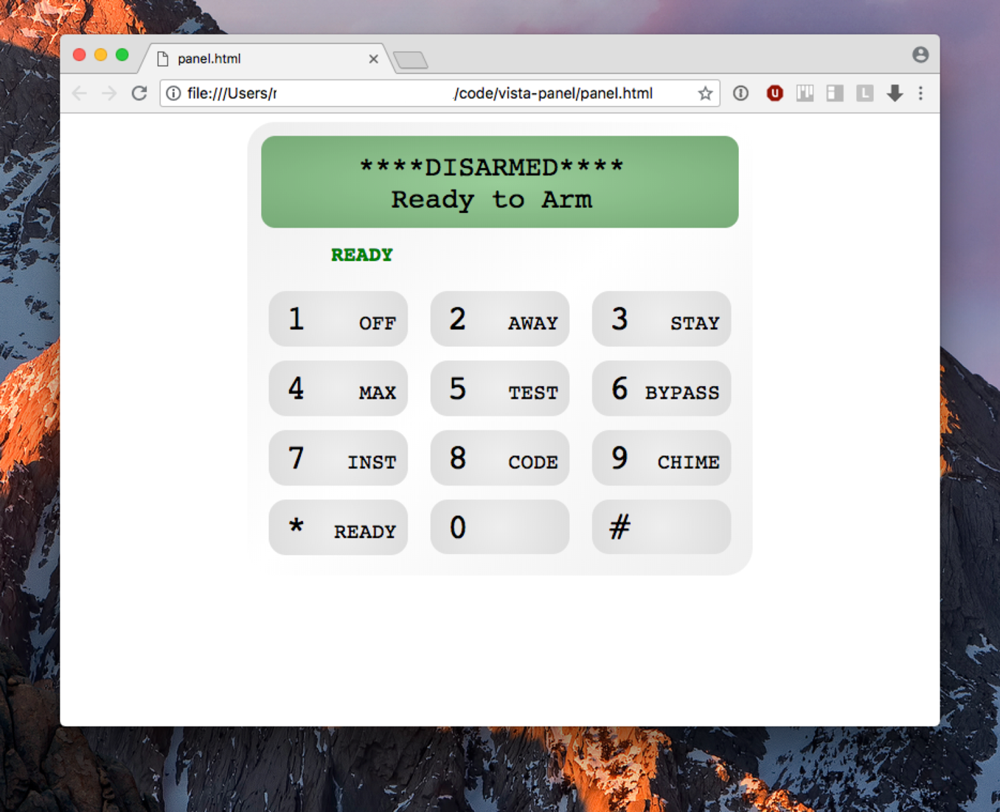

# vista-panel

Web UI for [IPDataTel](https://ipdatatel.com)-equipped Vista 20p (and probably others) security system.

Works with (and requires account with) [AlarmDealer](https://alarmdealer.com).

## Installation

- Clone repository.
- Fill in your account, password and device id into `secrets.js` (use `secrets-template.js` as an example).
- Open panel.html in any modern browser.
- Enjoy!

## Screenshot

